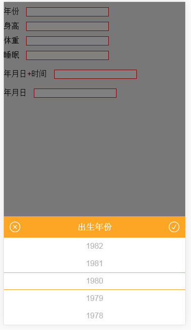
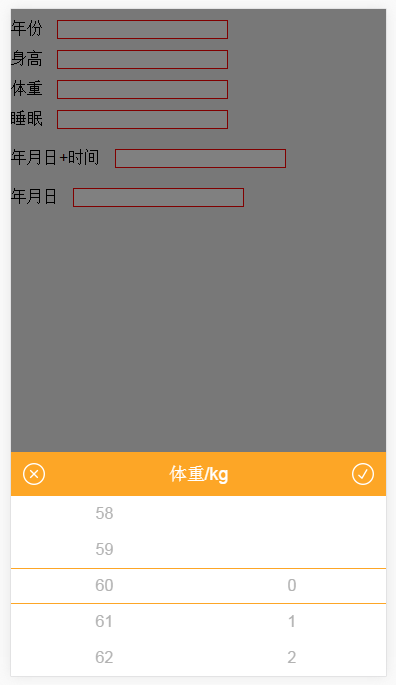
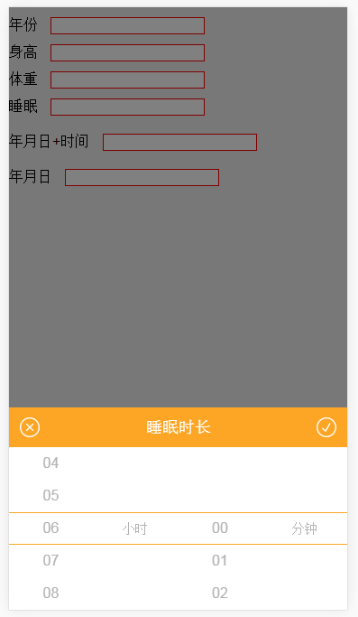
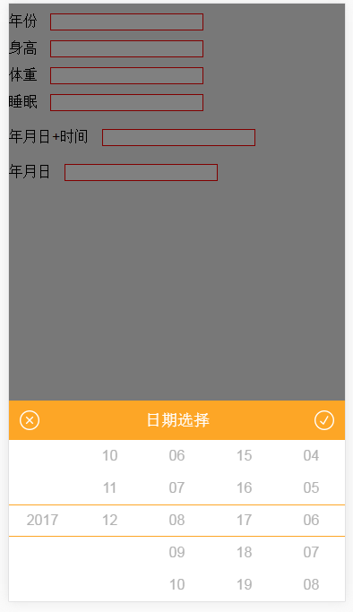
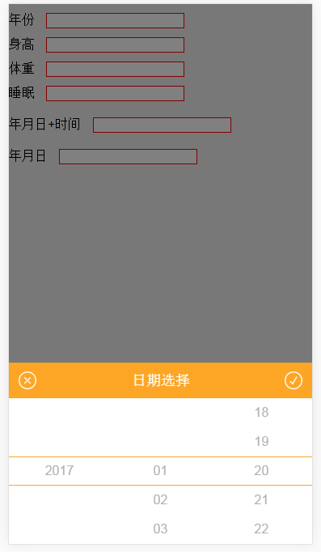

# mobile-selector

mobile-selector是一款基于jQuery的适用于移动端的选择器插件

效果图如下：

    

## How to Use?

mobile-selector 依赖于 jQuery. 

```html
<script src="jquery.js" type="text/javascript"></script>
<script src="jquery.selector.js" type="text/javascript"></script>
```

js调用

```js
  // 年份
    $.scrEvent({
        data: gYear,
        evEle: '.qu-year',
        title: '出生年份',
        defValue: 1980,
        afterAction: function(data){
            alert(data)
        }
    });

    // 身高
    $.scrEvent({
        data: quHeight,
        evEle: '.qu-height',
        title: '身高/cm',
        defValue: 170,
        afterAction: function(data){
            alert(data)
        }
    });

    //体重
    $.scrEvent2({
        data1: quWeightInt,
        data2: quWeightFl,
        evEle: '.qu-weight',
        title: '体重/kg',
        defValue: 60,
        defValue2: 0,
        linkType: '.',
        afterAction: function(data1, data2){
            $('.qu-time').attr('h', data1);
            $('.qu-time').attr('m', data2);
            alert('你选择的是：'+data1+ '.' +data2);
        }
    })

    
    //睡眠
    $.scrEvent2({
        data1: spoHour,
        data2: spoMinute,
        evEle: '.qu-time',
        title: '睡眠时长',
        defValue: 6,
        defValue2: 0,
        eleName: '小时',
        eleName2: '分钟',
        linkType: ':',
        afterAction: function(data1, data2){
            $('.qu-time').attr('h', data1);
            $('.qu-time').attr('m', data2);
            alert('你选择的是：'+data1+ '小时,' +data2 +'分钟');
        },
        beforeVal1:function (){
          return $('.qu-time').attr('h');
        },
        beforeVal2:function (){
          return $('.qu-time').attr('m');
        }
    })

    // 年月日 时分
    $.dateSelector({
        evEle:'.sp-date',
        linkType: '-',
        year: 1990,
        month: 12,
        day: 08,
        linkType: '-',
        startYear: '2017',
        endYear: '2017',
        timeBoo: true,
        afterAction: function(d1,d2,d3,d4,d5){
          console.log(d1,d2,d3);
          alert('你选择的是：'+d1+ '-' +d2 +'-'+ d3+'  '+d4+':'+d5);
        }
    });
    
    // 年月日
    $.dateSelector({
        evEle:'.sp-time',
        linkType: '-',
        startYear: '2017',
        endYear: '2017',
        timeBoo: false,
        afterAction: function(d1,d2,d3){
          console.log(d1,d2,d3)

          alert('你选择的是：'+d1+ '-' +d2 +'-'+ d3);
        }
    });
```

## API

### scrEvent：

| 参数          | 解释                                                        |
| ------------- | -----:                                                      |
| data          | 选择器取值范围，类型为数组                                  |
| evEle         | 要绑定触发事件元素的元素名称，如：class、id、element...     |
| title         | 选择器名称                                                  |
| afterAction   | 执行成功后的动作   参数：选中的文字                         |
| defValue      | 选择器默认值【可选,默认选择器数组的第一个数】               |
| beforeVal     | 每次触发事件前获取的选择器的默认值  【可选,默认上次选择结果值】 |


### scrEvent2：

| 参数          | 解释                                                         |
| ------------- | -----:                                                       |
| data1         | 选择器1取值范围，类型为数组                                  |
| data2         | 选择器2取值范围，类型为数组                                  |
| evEle         | 要绑定触发事件元素的元素名称，如：class、id、element...      |
| title         | 选择器名称                                                   |
| afterAction   | 执行成功后的动作   参数1：选中的文字1   参数2：选中的文字2   |
| defValue      | 选择器1默认值【可选,默认选择器数组的第一个数】               |
| defValue2     | 选择器2默认值【可选,默认选择器数组的第一个数】               |
| beforeVal1    | 每次触发事件前获取的选择器1的默认值  【可选,上次选择结果值】 |
| beforeVal2    | 每次触发事件前获取的选择器2的默认值  【可选,上次选择结果值】 |
| linkType:     | 选择器之间的连接符       【可选,默认''】                            |
| eleName       | 选择器1后跟随的单位        【可选】                          |
| eleName2      | 选择器2后跟随的单位            【可选】                      |


### dateSelector：

| 参数          | 解释                                                        |
| ------------- | -----:                                                      |
| evEle         | 要绑定触发事件元素的元素名称，如：class、id、element...     |
| title         | 选择器名称                                                  |
| afterAction   | 执行成功后的动作   参数：选中的文字                         |
| year          | 默认显示年【可选,默认当前年】                               |
| month         | 默认显示月【可选,默认当前月】                               |
| day           | 默认显示日【可选,默认当前日】                               |
| timeBoo       | true:使用年月日+时间 false:使用年月日  【可选,默认为false】 |
| hour          | 默认显示小时【可选,默认当前小时】                           |
| minute        | 默认显示分钟【可选,默认当前分钟】                           |
| startYear     | 显示年的开始区间开始时间 【可选,默认为当前年份的前后10年】  |
| endYear       | 显示年的开始区间结束时间 【可选,默认为当前年份的前后10年】  |
| type          | 触发事件元素的触发事件类型 【可选,默认'click'】             |
| linkType      | 年月日的中间连接符     【可选,默认'-'】                     |
