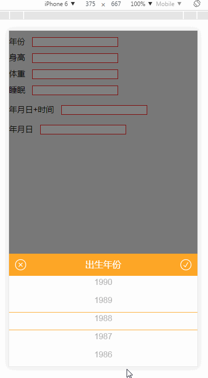
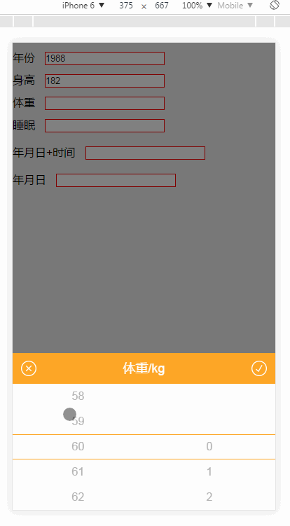
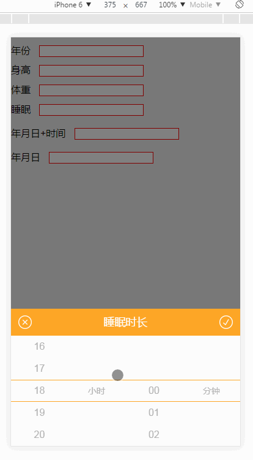

# mobile-selector

mobile-selector是一款基于jQuery/zepto的适用于移动端的选择器插件

效果图如下：

     

## How to Use?

mobile-selector 依赖于 jQuery/zepto. 

```html
<script src="jquery.js" type="text/javascript"></script>
<script src="jquery.selector.js" type="text/javascript"></script>
```

js调用

```js
    $.scrEvent({
      data: ['全国', '上海', '苏州', '杭州', '南京', '武汉', '深圳', '北京'],   //数据
      evEle: '.qu-year',            //选择器
      title: '切换城市',            // 标题
      defValue: '全国',             // 默认值
      afterAction: function (data) {   //  点击确定按钮后,执行的动作
        $(".qu-year").val(data);
      }
    });

    // 体重范围，20-100(整数)，0-9(小数)
    // 整数
    var quWeightInt = [20, 21, 22, 23, 24, 25, 26, 27, 28, 29, 30, 31, 32, 33, 34, 35, 36, 37, 38, 39, 40, 41, 42, 43, 44, 45, 46, 47, 48, 49, 50,
     51, 52, 53, 54, 55, 56, 57, 58, 59, 60, 61, 62, 63, 64, 65, 66, 67, 68, 69, 70, 71, 72, 73, 74, 75, 76, 77, 78, 79, 80, 81, 82, 83, 84, 85, 
     86, 87, 88, 89, 90, 91, 92, 93, 94, 95, 96, 97, 98, 99, 100];
    // 小数
    var quWeightFl = [0, 1, 2, 3, 4, 5, 6, 7, 8, 9];
    //体重
    $.scrEvent2({
      data: quWeightInt,
      data2: quWeightFl,
      evEle: '.qu-weight',
      title: '体重/kg',
      defValue: 60,
      defValue2: 0,
      afterAction: function (data1, data2) {

        $('.qu-weight').val(data1 + '.' + data2);
      }
    })

     // 时长数据
      // 小时
      var spoHour = ["00", "01", "02", "03", "04", "05", "06", "07", "08", "09", "10", "11", "12", "13", "14", "15", "16", "17", "18", "19", "20", 
      "21", "22", "23"];
      // 分钟
      var spoMinute = ["00", "01", "02", "03", "04", "05", "06", "07", "08", "09", "10", "11", "12", "13", "14", "15", "16", "17", "18", "19", "20",
      "21", "22", "23", "24", "25", "26", "27", "28", "29", "30", "31", "32", "33", "34", "35", "36", "37", "38", "39", "40", "41", "42", "43", "44",
      "45", "46", "47", "48", "49", "50", "51", "52", "53", "54", "55", "56", "57", "58", "59"];

    //睡眠
    $.scrEvent2({
        data: spoHour,
        data2: spoMinute,
        evEle: '.qu-time',
        title: '睡眠时长',
        defValue: 6,
        defValue2: 0,
        eleName: '小时',
        eleName2: '分钟',
        afterAction: function (data1, data2) {
          $('.qu-time').val(data1 + '小时' + data2 + '分钟');
        }
    })

    // 年月日
    $.dateSelector({
        evEle: '.sp-time',
        startYear: '2017',
        endYear: '2017',
        timeBoo: false,
        afterAction: function (d1, d2, d3) {
          $('.sp-time').val(d1 + '-' + d2 + '-' + d3);
        }
    });

    // 年月日 时分
    $.dateSelector({
      evEle: '.sp-date',
      year: 1990,
      month: 12,
      day: 08,
      startYear: '1990',
      endYear: '2017',
      timeBoo: true,
      afterAction: function (d1, d2, d3, d4, d5) {
        $('.sp-date').val(d1 + '-' + d2 + '-' + d3 + '  ' + d4 + ':' + d5);
      }
    });
```

## API

### scrEvent：

| 参数          | 解释                                                    |
| ------------- | -----:                                                  |
| data          | 选择器取值范围，类型为数组                              |
| evEle         | 要绑定触发事件元素的元素名称，如：class、id、element... |
| title         | 选择器名称                                              |
| defValue      | 选择器默认值    【可选,默认选择器数组的第一个数】       |
| beforeAction  | 执行成功前的动作   无参数                               |
| afterAction   | 执行成功后的动作   参数：选中的文字                     |


### scrEvent2：

| 参数          | 解释                                                       |
| ------------- | -----:                                                     |
| data          | 选择器1取值范围，类型为数组                                |
| data2         | 选择器2取值范围，类型为数组                                |
| evEle         | 要绑定触发事件元素的元素名称，如：class、id、element...    |
| title         | 选择器名称                                                 |
| defValue      | 选择器1默认值【可选,默认选择器数组的第一个数】             |
| defValue2     | 选择器2默认值【可选,默认选择器数组的第一个数】             |
| eleName       | 选择器1后跟随的单位        【可选】                        |
| eleName2      | 选择器2后跟随的单位            【可选】                    |
| beforeAction  | 执行成功前的动作   无参数                                  |
| afterAction   | 执行成功后的动作   参数1：选中的文字1   参数2：选中的文字2 |


### dateSelector：

| 参数          | 解释                                                        |
| ------------- | -----:                                                      |
| evEle         | 要绑定触发事件元素的元素名称，如：class、id、element...     |
| title         | 选择器名称                                                  |
| year          | 默认显示年【可选,默认当前年】                               |
| month         | 默认显示月【可选,默认当前月】                               |
| day           | 默认显示日【可选,默认当前日】                               |
| timeBoo       | true:使用年月日+时间 false:使用年月日  【可选,默认为false】 |
| hour          | 默认显示小时【可选,默认当前小时】                           |
| minute        | 默认显示分钟【可选,默认当前分钟】                           |
| startYear     | 显示年的开始区间开始时间 【可选,默认为当前年份的前后10年】  |
| endYear       | 显示年的开始区间结束时间 【可选,默认为当前年份的前后10年】  |
| type          | 触发事件元素的触发事件类型 【                               |
| beforeAction  | 执行成功前的动作   无参数    中的文字1-5                    |
| afterAction   | 执行成功后的动作   参数1-5：选可选,默认'click'】            |
